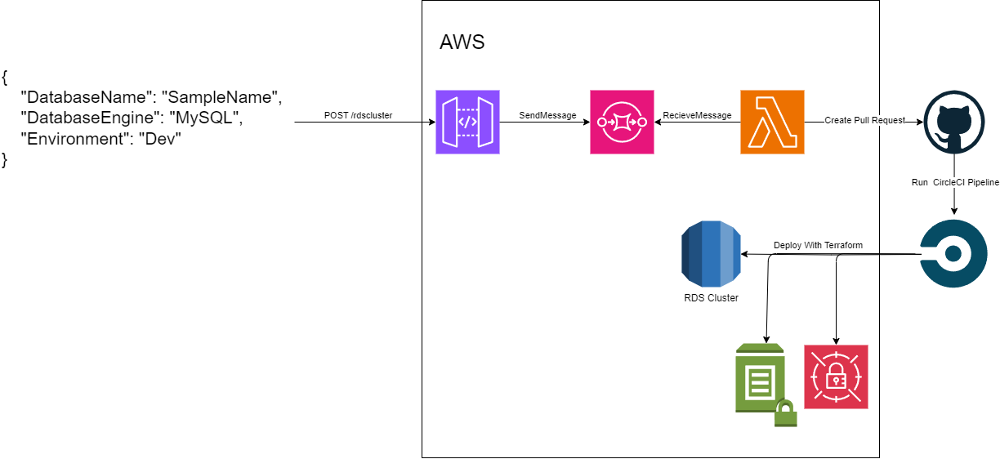

# Solution Overview
This solution deploys a serverless infrastructure on AWS which enabled users to create RDS single-instnace clusters on-demand.



Clusters are requested through an API and the requests are processed in a Lambda function, which then creates a PR on the Gitub repository hosting this solution, from a new branch to the master branch. The PR contains a `tfvars` file that, after PR has been approved and merged, is used by a CircleCI pipeline to deploy the RDS cluster with Terraform.
The solution currently support setting the database's name, its engine (either MySQL or Postgres) and an environment (Prod and Dev, which set the instance size to `db.4tg.micro` or `db.t3.micro`, accordingly).

## Structure of the Repository

-  `/infra` contains the SAM template which deploys the API Gateway, an SQS Queue as its integration, and a Lambda Function which consumes from the queue and creates the PR.
- `/terraform` contains the Terraform module used for RDS cluster deployment. The module has 3 inputs: `database_name`, `database_engine`, and `environment`, which are used to define the RDS cluster.
- `/clusters` contains `tfvar` files that define RDS cluster. Each file corresponds with a single RDS cluster, and contains variables that correspond with the three inputs of the Terraform module. (_Note_, this folder is created only after a cluster has been requested)
- `.circleci` contains the CircleCI pipeline configuration.

# Deployment Instructions

## Prerequisites
- A certificate in ACM to be used for a custom domain for API Gateway
- A registered domain in Route 53 or another registrar for a custom domain for API Gateway
- A DNS record for the registered domain, in a Route 53 hosted zone
- Github token with `read` and `write` access to `code`, `commit status`, and `pull requests` in your repository.
- Access key with permissions to deploy the following services on AWS:
    - API Gateway
    - SQS
    - Lambda
    - RDS
    - Secrets Manager
    - SSM Parameter Store
    - CloudFormation
    - S3

To start deploying this solution, fork or clone this repository to your own. Go to the `infra/template.yaml` and set the Mappings value as follows:

- `Lambda.Variables.RepoOwner` - The owner of the repository hosting this solution
- `Lambda.Variables.RepoName` - The name of the repository hosting this solution
- `Lambda.Variables.GithubToken` - The Github token as described previously
- `ApiGateway.Domain.CertificateArn` - ARN for the previously descibed certificate
- `ApiGateway.Domain.Name` - The registered domain name for the API Gateway

Next, create a CircleCI project for your repository. Follow the instructions on CircleCI and make sure the `.circleci/config.yml` file is selected as the config.
For the triggers, create a single trggier for `Pushes to default branch`.
Finish the setup and go to the project's environment variables. you must set the following variables:
- `AWS_ACCESS_KEY` - Access key ID with appropriate credentials to deploy the solution
- `AWS_SECRET_ACCESS_KEY` - Secret access key for the access key
- `AWS_REGION` - the region in which you want the solution deployed

    

After this is done, you can create a PR to `master` with a `clusters/<db_name>.tfvars` file in the following format and merge it:
```
database_name = "<db_name>"
database_engine = "<db_engine>"
environment = "<environment>"
```
this will trigger the CiurcleCI pipeline, which will first deploy the SAM inmfrastructure and then the RDS cluster.
You can also trigger the pipeline without a cluster file, which will deploy only the SAM infrastructure.

# Deploying RDS Clusters

To deploy an RDS cluster, you need to call a POST request to the `/rdscluster` resource of your API, e.g. if your API is called `example.com`, you will send a POST request to `https://example.com/rdscluster`.
The body of the request must be in the following structure:
```
{
    "DatabaseName": "<databasename>",
    "DatabaseEngine": "<Postgres|MySQL>",
    "Environment": "<Dev|Prod>"
}
```
Additionally, an API key must be supplied to the request in the `x-api-key` header.
The API key can be obtained through the AWS console in API Gateway -> API Keys -> infra-ApiGat-xxxxxxxxxxx.

After a database has finished creating, its credentials are saved in an SSM parameter, and a secret in Secrets Manager.
The username is located in `/databases/<db_engine>/<db_name>/username`.
The password's secret name can also be obtained from an SSM parameter located in `/databases/<db_engine>/<db_name>/secret`

# Additional Info

- This solution only allows creating databases, modifications and deletions are not available.
- Unless the domain has been registered and a record has been added to a Route 53 hosted zone, the custom domain for the API Gateway will not be operable. Instead, the generated domain should be invoked to create databases. This can be found in API Gateway -> APIs -> CreateRdsCluster -> Stages,  then expand the Prod stage and find the `/rdscluster` POST method. Select it and within you will find the invocation URL.
- When deploying a database, deployment times should take between 5 and 10 minutes.